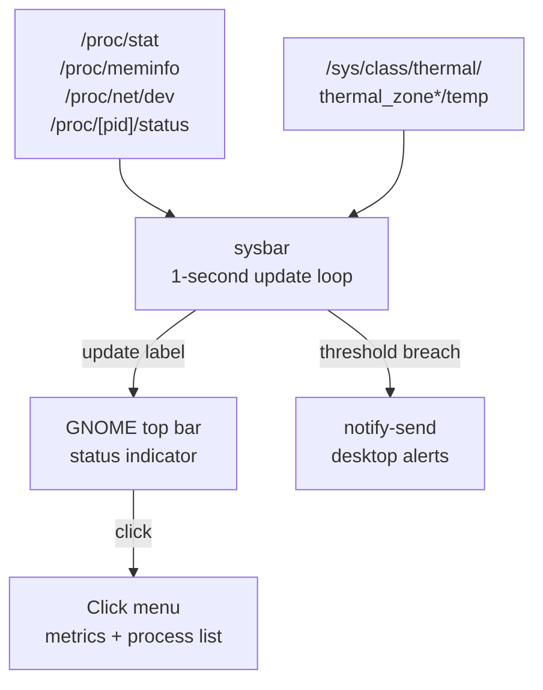

# sysbar

System stats indicator for the GNOME top bar. Shows live CPU, RAM, temperature, and network speed — updated every second. Click the indicator for a detailed breakdown and to kill runaway processes.

## What it looks like

```
🟢  ↓1.2MB ↑80KB  CPU 12%  RAM 4.1GB  42°C
```

The status dot turns amber at warning thresholds and red at critical.

## Requirements

- Ubuntu 22.04+ with GNOME Shell
- Python 3.10+
- AyatanaAppIndicator3 or AppIndicator3

Dependencies are installed automatically by `./install`.

## Install

```bash
./install
```

This installs the required GNOME/Python packages, copies `sysbar` to `/usr/local/bin/`, creates an autostart entry at `~/.config/autostart/sysbar.desktop`, and launches the indicator.

**Run manually** (without installing):

```bash
python3 sysbar
```

## How it works



Reads directly from the Linux `/proc` and `/sys` filesystems — no external dependencies for metrics.

## Indicator display

The top bar label shows:

- **Status dot** — 🟢 OK / 🟡 warning / 🔴 critical
- **Network** — current download ↓ and upload ↑ speed on the default interface
- **CPU** — usage percentage
- **RAM** — used GB
- **Temperature** — CPU package temperature in °C (or `N/A` if unavailable)

## Click menu

Clicking the indicator opens a menu with:

- Progress bars for CPU, RAM, swap, and temperature with color-coded status
- Top 5 RAM-consuming processes — click any to kill it (with confirmation dialog)
- Network interface name and current speeds

## Alerts

Desktop notifications fire when metrics stay critical for a sustained period:

| Metric | Warning | Critical | Trigger |
|--------|---------|----------|---------|
| CPU | 70% | 90% | 5 consecutive seconds at critical |
| RAM | 75% | 90% | Immediate |
| Swap | 30% | 60% | Immediate |
| Temperature | 80°C | 95°C | Immediate |

A 30-minute cooldown prevents repeated notifications for the same metric. Cooldown state is saved to `~/.sysbar-notify-state.json` and survives restarts.
